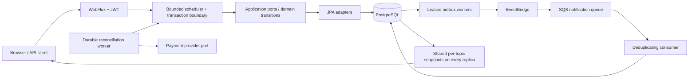

# Architecture

Core code has no Spring, JPA, AWS SDK or Reactor dependencies. JPA `BookingEntity` is separate from immutable domain `Booking`. Query adapters return eagerly mapped projections within transaction scope. No lazy entity is returned through HTTP. `Transactions` is an application port; `JpaTransactions` is the explicit Spring TransactionTemplate adapter. `BlockingBoundary.call` schedules the entire transaction on `jpa-*`. A runtime guard rejects JPA transaction entry from Reactor nonblocking threads. Security identity is passed explicitly as a subject string; Reactor automatic context propagation carries registered Micrometer tracing context across the scheduler. No request handler uses subscribe(), block(), or a reactive thread switch inside a transaction.

Admission: at most 128 ordinary requests and 100 SSE streams per replica; 200 requests/second per replica. Bounded scheduler saturation returns 503. The configurable fixed executor defaults to eight threads and a single FIFO queue of 64 tasks; this avoids uneven per-worker queueing. Startup validates that at least four pool connections remain for background work. Workers have their own four platform threads and one task per loop. Hikari has 16 connections, leaving headroom over eight HTTP and four worker operations. Each replica adds this connection demand; a four-replica rolling deployment may temporarily have eight tasks, so review RDS max_connections and scale limits before increasing DesiredCount. CPU, lock waits, database I/O and snapshot traffic bound throughput; this is not a fully nonblocking system. Spring MVC/virtual threads would simplify thread management; R2DBC would require replacing the persistence stack. Neither substitution was made.

## Locking and atomicity

Reservation lock order is PostgreSQL transaction-scoped advisory lock over `(owner,key)`, then `showtime FOR SHARE`, then existing seat-owner bookings in ascending UUID order, then requested seat rows in ascending label order. Shared show locks prevent concurrent administration while allowing reservations to run concurrently. Expired owners are transitioned and their inventory released before acquiring requested seat locks. Releases only affect rows still referencing that locked booking. No booking lock is acquired after requested inventory locks. If ownership changed between discovery and inventory locking, the final occupancy check returns `SEAT_UNAVAILABLE`; retrying can reclaim a newly expired owner. This conservative conflict prevents lock-order inversion.

Settlement, payment initiation, cancellation and refunds use a booking `FOR UPDATE` lock and reload the entity after waiting. Cancellation takes the shared metadata lock first to read showtime policy. Expiry selects only expired ACTIVE bookings, locks in ascending UUID order, reloads and rechecks time/state. Screen scheduling retains its screen lock. PostgreSQL row locks, not process-local locks, arbitrate replicas. See [PostgreSQL row-lock semantics](https://www.postgresql.org/docs/17/explicit-locking.html).

`show_seat(show_id,label)` is the single ownership slot, with a foreign key tying its booking to the same show. Claim updates require `booking_id IS NULL`. All requested seat locks are acquired before insert/assignment; a failed condition rolls the transaction back. Unique request keys and ticket constraints remain. Availability may advertise expired seats before physical cleanup; reservations reclaim the relevant expired owners transactionally. Commit remains authoritative.

Each change persists its outbox event with the booking transaction. Cancellation revokes existing tickets; duplicate confirmation inserts with `ON CONFLICT DO NOTHING`. A late success can only confirm an ACTIVE hold strictly before its expiry. All other successful payments schedule a full refund without allocating any seat. Out-of-order failure after success is ignored; success after previously reported failure is treated as a charge requiring compensation. Duplicate refund acknowledgement is a no-op.

## State machines

| Machine | Allowed transitions |
|---|---|
| Booking | HELD → PAYMENT_PENDING, EXPIRED, CANCELLED; PAYMENT_PENDING → CONFIRMED, FAILED, EXPIRED, CANCELLED; CONFIRMED → CANCELLED; FAILED/EXPIRED → CANCELLED before show; terminal cancellations stay CANCELLED |
| Hold | ACTIVE → CONSUMED on valid success; ACTIVE → EXPIRED on elapsed deadline; ACTIVE/CONSUMED → RELEASED on cancellation; ACTIVE → RELEASED on failure; expired/released never become ACTIVE |
| Payment | NONE → PENDING; PENDING → UNKNOWN/SUCCEEDED/FAILED; UNKNOWN → SUCCEEDED/FAILED; FAILED → SUCCEEDED only with compensation; SUCCEEDED ignores later failures/duplicates |
| Refund | NONE → PENDING for a successful invalid/cancelled booking; PENDING → SUCCEEDED after provider acknowledgement; failed/uncertain attempts remain PENDING and are retried |

Booking and hold are created together. Expiry/cancellation does not discard pending payment state: reconciliation continues because the provider may have charged. Refund has no terminal FAILED state: losing an obligation because a retry budget elapsed would be incorrect. Exponential retry delays persist, cap at 300 seconds, and require operational intervention for sustained failures. Automatic reconciliation is indefinite while the obligation remains; per-call SDK retries are bounded. No new payment or refund idempotency key is generated during recovery.

Restart-safe expiry queries indexed expired ACTIVE rows every second. A missed expiry job is harmless to safety; every reservation and settlement rechecks time. The injected UTC clock enables boundary tests. Production hosts require reliable NTP; both advisory availability and domain decisions use the injected UTC clock.

## Events and notifications

Every booking version emits `BookingChanged.v1`, source `cinema.booking`. Detail contains stable eventId, schemaVersion=1, type, aggregateId/version, UTC occurredAt, correlationId (booking), causationId (previous outbox event, or initial booking command ID), status, showId. It also carries optional W3C traceParent context so the consumer can continue the originating trace. It contains no customer identity or payment details. Schema: `events/booking-changed-v1.schema.json`. Notification routing uses exact source and detail type. The consumer materializes an in-app notification projection, not email/SMS delivery. Email/SMS would need its own outbox and provider idempotency strategy.

Claims use short transactions with `FOR UPDATE SKIP LOCKED`, a 60-second lease and random fencing token. Network calls happen after commit. Each EventBridge result is checked independently. Retry delay increases exponentially to 300 seconds. A publisher dying after publication but before marking will republish the same event ID after lease expiry. Marking requires the current claim token. At-least-once delivery is intentional; there is no exactly-once claim.

SQS acknowledgements follow the successful side-effect transaction. The receipt `(consumer,eventId)` and monotonic notification upsert commit together. Delayed lower aggregate versions cannot regress state. Unsupported envelopes/schemas fail and enter the consumer DLQ after five receives. Visibility is 60 seconds; processing transactions are limited to five seconds. Failed receives use bounded exponential visibility backoff. Receipt deletion is not tied to a connection-local memory cache.

EventBridge target DLQ handles delivery to SQS (permissions/unavailable target/retry exhaustion). SQS consumer DLQ handles accepted queue messages that repeatedly fail processing. These are distinct queues and recovery procedures. Durable payment reconciliation is driven by database obligations rather than consumer delivery order; EventBridge availability is not on the charge/seat correctness path.

## Live behavior

SSE shares a replay-one, reference-counted polling stream per `show:<UUID>` or `user:<subject>` on each replica. One transaction runs per topic every two seconds, with at most one in-flight read and dropped excess timer ticks. One hundred viewers of the same show perform one query per tick, not one hundred. Distinct users have separate streams, preserving ownership. Replicas independently read committed PostgreSQL state, so correctness does not depend on SQS consumer selection or ephemeral notifications.

The first subscriber loads a snapshot immediately; additional/reconnecting subscribers receive the latest cached snapshot and the next periodic refresh. Normal cache age is at most two seconds, but database/scheduler delays can extend this; snapshots are always advisory. Each carries a heartbeat comment and opaque ID. Last-Event-ID is not a replay cursor. No history of missed events is needed because clients replace their state. The final subscriber leaving cancels polling and removes the cache entry. A shared read failure terminates the topic, prompting client reconnection. Each subscriber has a latest-only buffer; JWT expiry, five-minute connection lifetime and the 100-stream cap still apply. Reads scale with active topics and replicas, not client count; this deliberately retains bounded polling without another infrastructure dependency.
